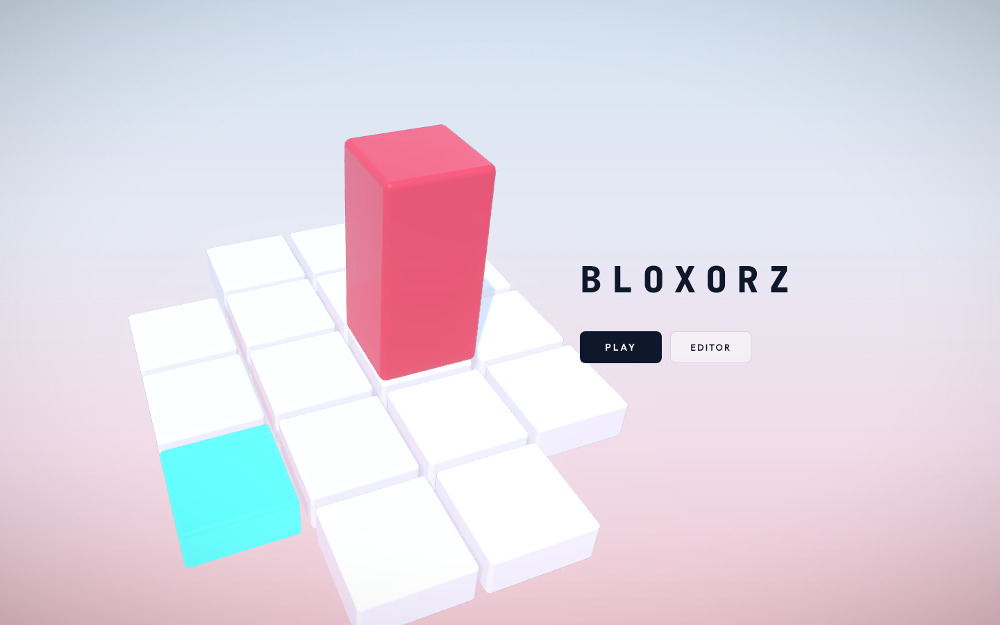
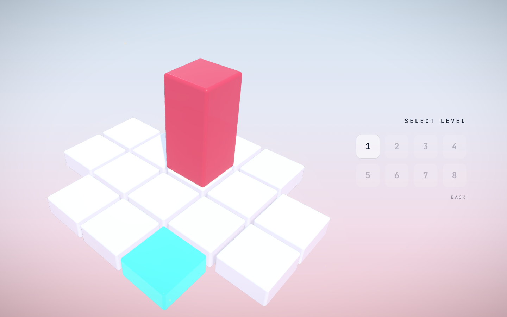
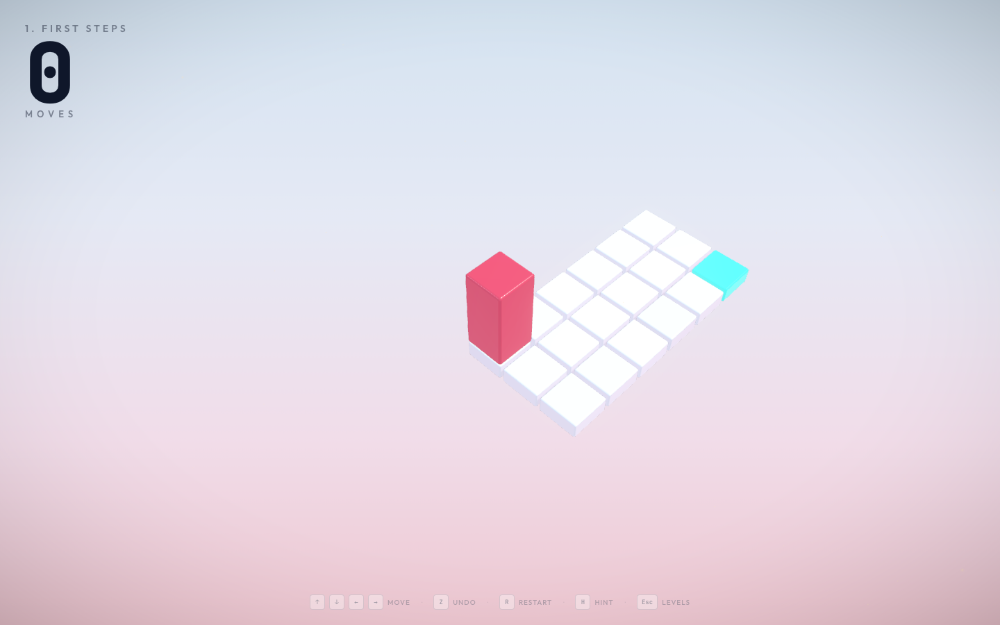
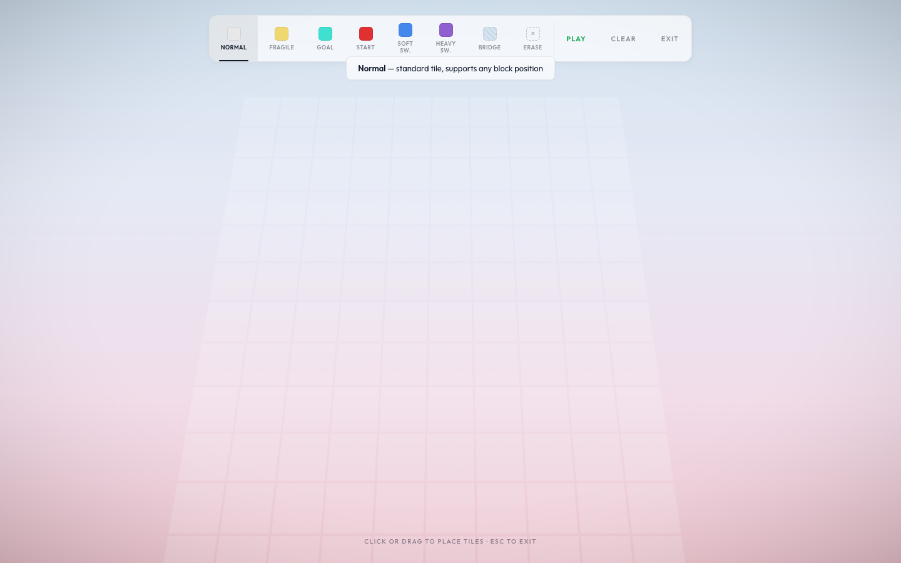
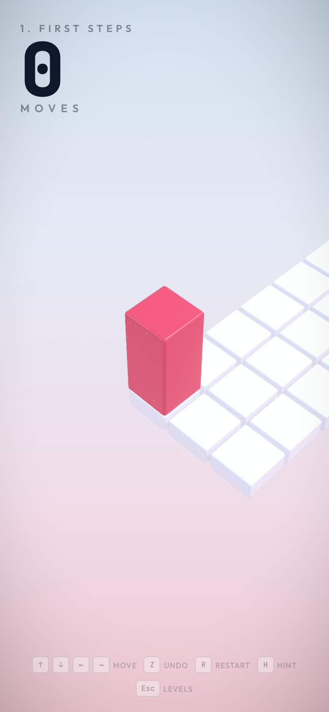

# Bloxorz 3D Report

Computer Graphics Course Project

Submission date: June 11, 2026

## Introduction

Bloxorz 3D is a browser-based 3D puzzle game inspired by the classic Bloxorz block-rolling mechanic. The player controls a rectangular block on a tile board and tries to reach the goal tile. The goal is accepted only when the full block is standing upright on it, so the puzzle is about both position and orientation.

The project is implemented as a real-time WebGL application with Three.js. It includes a complete menu flow, level selection, eight playable levels, saved progress, animated block movement, level mechanics, a custom editor, procedural audio, visual feedback, postprocessing, and an automated level verification script.

The main design decision is to keep the puzzle state discrete while making the rendered result continuous. The board logic uses exact grid cells. The visible block uses smooth 3D transforms, lighting, shadows, particles, and camera movement.

## Motivation

The motivation was to build a project that clearly belongs to Computer Graphics while still being playable. A Bloxorz-style game is a good fit because every move can be explained with transformations. The block translates and rotates in 3D, the camera follows the active object through a view transform, the perspective camera projects the world onto the screen, and the final frame is shaped by lighting, materials, shadows, fog, and postprocessing.

The game also gives a natural place to use graph search. The hint system uses breadth-first search, and the same idea is used to verify the official par values. This makes the project stronger than a scene-only graphics demo, because the implementation is both graphical and rule-driven.

## What Was Built

The final implementation has eight official levels with verified shortest par values. It has a rolling cuboid with three logical orientations, normal tiles, fragile tiles, soft switches, heavy switches, bridges, teleport split mode, cube merge, and strict goal validation.

The project also includes a custom level editor with raycast-based mouse placement. Progress, completion state, and best move counts are saved with `localStorage`. The player can use keyboard input, touch swipes, undo, restart, and hints. The game has a third-person gameplay camera, separate menu/editor camera flows, procedural sound effects, particles, and responsive UI.

The visual side uses WebGL through Three.js. The scene uses physical materials, shadows, fog, a procedural sky, environment lighting, SMAA, bloom, and vignette. The implementation also includes a BFS hint solver for non-teleport official levels and a verification script that checks every listed par value, including the split-cube level.

## Implementation Snapshots

These snapshots are grouped together so the reader can see the main visual states before reading the implementation details.












## Project Structure

The main application flow lives in `src/main.js`. It controls the home screen, level selection, gameplay, editor entry, level loading, transitions, hints, and the render loop.

The movement rules live in `src/controls.js`. This file handles rolling, validation, falling, winning, undo, switches, teleport split mode, cube movement, and cube merging. The board builder is `src/grid.js`, which creates tile meshes, switch indicators, bridge tiles, bridge state, tile removal, and hint highlights. The block and split cubes are created in `src/block.js`.

The official level data is stored in `src/levels.js`. The BFS hint solver is in `src/solver.js`, and `scripts/check-levels.js` verifies the official par values. The custom editor is implemented in `src/editor.js`. Rendering setup is split across `src/scene.js`, `src/camera.js`, `src/lighting.js`, and `src/themes.js`. Feedback systems are placed in `src/particles.js`, `src/sounds.js`, and `src/shake.js`.

## Game Flow

The application has four main states. The home screen shows the title, a small 3D preview board, and the Play and Editor buttons. The level select screen shows all eight official levels, dims locked levels, marks completed levels, and shows a star when the saved best move count is less than or equal to par.

During gameplay, the screen shows the active board, the rolling block, the move counter, the level title, control hints, and temporary win or fall overlays. In editor mode, the camera moves to a top-down view and the player can place normal tiles, fragile tiles, goal, start, soft switches, heavy switches, bridges, and eraser actions.

Progress is saved in `localStorage` under one project key. The saved data stores completed level IDs and best move counts, so progress remains after refresh.

## Level Data and Board Representation

Each official level is stored as a two-dimensional grid in `src/levels.js`. The number `0` means empty space, `1` means normal tile, `2` means goal tile, `3` means fragile tile, `4` means soft switch, `5` means heavy switch, and `6` means teleport switch.

Switches and bridges are stored separately from the basic layout. This matters because bridge tiles can appear and disappear while the level is running. The layout tells the game where fixed tiles are. The bridge state tells the game which dynamic tiles currently exist.

The official levels are First Steps with par 8, Over the Edge with par 7, Fragile Ground with par 6, Open Sesame with par 6, Heavy Duty with par 12, Split Decision with par 8, Twin Bridges with par 13, and The Gauntlet with par 15.

## Puzzle State

The main block state is:

```text
x, z, orientation
```

The orientation can be:

```text
standing
lying_x
lying_z
```

When the block is `standing`, it occupies one tile. When it is `lying_x`, it occupies two neighboring tiles along the x axis. When it is `lying_z`, it occupies two neighboring tiles along the z axis.

A standing block at `x = 2`, `z = 3` occupies row 3, column 2. A `lying_x` block centered at `x = 2.5`, `z = 3` occupies row 3, columns 2 and 3. A `lying_z` block centered at `x = 2`, `z = 3.5` occupies rows 3 and 4, column 2.

The occupied cells decide whether the block falls, whether a switch activates, whether a fragile tile breaks, and whether the goal is reached.

## Movement Implementation

Movement starts from a keyboard event, touch swipe, or split-cube move. The code first computes the next logical state. Then it animates the mesh toward that state.

From `standing`, a move makes the block lie down and the center moves 1.5 cells. From `lying_x`, moving left or right can stand the block up, while moving up or down slides the lying block sideways by one cell. From `lying_z`, moving up or down can stand the block up, while moving left or right slides the lying block sideways by one cell.

The visual motion uses `Vector3.lerpVectors` for position interpolation and `Quaternion.slerpQuaternions` for rotation. A short vertical arc makes the motion feel like a roll instead of a slide. After each move, the mesh snaps to the exact target position and quaternion so floating-point drift does not accumulate.

This directly connects to transformation concepts from the course. The logical state changes in grid space, and the visible mesh changes with translation and rotation in world space.

## Tile Mechanics

Normal tiles support the block in any legal orientation. Goal tiles finish the level only when the full block stands upright on them. A lying block touching the goal is not enough.

Fragile tiles break only when the full block stands upright on them. The tile is removed, shatter feedback plays, and the block falls. Soft switches activate when any occupied cell touches them, so a standing block, lying block, or split cube can trigger them. Heavy switches activate only when the full block stands upright on them, which forces the player to plan orientation as well as position.

Bridges are dynamic support tiles. Switches toggle their target bridge cells. The bridge state is saved in move history and included in solver states. Teleport switches split the full block into two smaller cubes. The player controls one cube at a time, switches active cube with Space, and merges back into one lying block when the cubes become adjacent.

## Editor Implementation

The editor uses the same Three.js scene, but it switches the camera to a stable top-down view. It keeps an internal 14 by 10 grid and draws a faint placement grid.

Mouse placement uses `THREE.Raycaster`. The mouse position is converted to normalized device coordinates, a ray is cast from the camera, and the ray intersects a horizontal plane. The hit point is rounded to a row and column. That cell is then edited with the active tool.

The editor enforces one start tile and one goal tile. If a new goal is placed, the old goal becomes a normal tile. Custom bridge behavior is intentionally simple: custom switches target all custom bridge cells. This keeps the editor usable during a short demo without needing a separate bridge-linking UI.

## Rendering and Course Concepts

The project follows the graphics pipeline discussed in the lecture notes:

```text
scene data
geometry
model transform
view transform
projection
rasterization
fragment shading
frame buffer
```

The level layout starts as data. `src/grid.js` converts that data into tile meshes. The block and cubes are also meshes. These objects are placed in world space through model transforms.

The view transform comes from the camera. In gameplay, the camera follows the active block or active split cube from a fixed offset. It lerps toward a target camera position and target look-at point so the framing stays smooth. Projection is handled by `THREE.PerspectiveCamera`, which maps the 3D scene into the 2D browser canvas with perspective depth.

Rasterization is handled by WebGL through Three.js. Triangles from the block, tiles, bridge meshes, particles, and editor grid become fragments on the canvas. Fragment shading is provided through Three.js materials and postprocessing effects. The project does not claim custom GLSL shaders for the block; Three.js and the postprocessing package generate and manage those shader programs.

The ray/path tracing lecture is still relevant conceptually, but the final game uses real-time rasterized rendering. That is the appropriate choice for an interactive puzzle game with constant input, animation, and UI.

## Lighting, Materials, and Visual Feedback

The scene uses `AmbientLight` for base visibility, `HemisphereLight` for soft sky and ground contribution, `DirectionalLight` as the main sun, and a second directional fill light. The main shadow-casting light follows the active block position, so the shadow camera stays centered near the board.

Tiles and blocks use `MeshPhysicalMaterial`. Important parameters include color, roughness, metalness, clearcoat, emissive color, and environment intensity. Goal tiles use emissive color to stand out, and switches have small 3D indicator shapes on top.

The background sky is procedural. A canvas is drawn with a gradient, clouds, and soft mountain shapes, then used as a `CanvasTexture`. Themes change sky color, fog color, tile color, goal color, block color, and sparkle color.

Postprocessing uses SMAA to reduce jagged edges, Bloom to give bright goal and effect areas a soft glow, and Vignette to slightly darken the edges so attention stays near the board. Feedback systems add landing dust, fragile tile shatter, bridge and switch effects, celebration particles, small screen shake, and sparkles around the level.

## Audio and Persistence

Audio is procedural and does not use external sound files. `src/sounds.js` creates tones and noise through the browser Web Audio API. Movement uses a short tone and noise burst, falling uses a descending oscillator and noise, and winning uses a small sequence of tones.

Persistence uses `localStorage`. The game saves completed levels and best move counts, so progress remains after refreshing the page.

## BFS Hint Solver

The hint solver is one of the most important implementation parts.

BFS means breadth-first search. It explores a graph one layer at a time. In this project, each graph node is a possible puzzle state, and each edge is one legal move.

The solver starts from the current block state. It tries all four movement directions. Every valid result becomes a new state in the queue. Then the solver tries all moves from those states, and this continues until the goal is found or no states remain.

Because BFS explores by distance from the start, the first time it reaches the goal, the solution is guaranteed to use the smallest possible number of moves. The hint system uses the first move of that shortest solution.

The state key includes:

```text
x position
z position
orientation
bridge mask
```

The bridge mask is important because the same block position can mean different things depending on which bridges are currently visible. A bridge may now exist, or it may have disappeared. The solver stores bridge states as bits so it can compare states quickly.

The solver also avoids infinite loops with a `visited` set. If the same position, orientation, and bridge state has already been explored, it is skipped.

The in-game hint solver intentionally returns `null` for teleport levels. Split mode has more state because it has two cubes, one active cube, and merge behavior. Instead of forcing that extra logic into the in-game hint UI, split-mode verification is handled in `scripts/check-levels.js`.

## Par Verification

Par means the expected best move count for a level. In this project, par is not guessed. It is checked by script.

`npm run check:levels` loads every official level and solves it. For normal levels, it uses `src/solver.js`. For the teleport split level, the script includes an expanded BFS that can represent two split cubes, the active cube index, bridge state, and merge back into a full block.

The verified shortest paths are:

```text
1  First Steps       8
2  Over the Edge     7
3  Fragile Ground    6
4  Open Sesame       6
5  Heavy Duty       12
6  Split Decision    8
7  Twin Bridges     13
8  The Gauntlet     15
```

The script fails if a level has no solution or if the shortest solution length does not match the listed par. This gives a practical quality check before the demo.

## Testing and Verification

The final checks were:

```text
npm run check:levels
npm run build
npm audit
Playwright browser walkthrough and screenshot capture
```

The Playwright walkthrough opened the actual local app, cleared saved progress, captured the home screen, level select, gameplay, hint state, editor, and mobile viewport. The screenshot files in this report come from that run.

## What Was Implemented Directly and What Uses Libraries

The project directly implements the level data format, block movement rules, orientation transitions, occupied-cell validation, fragile tile behavior, switch behavior, bridge toggling, teleport split mode, cube merge, falling, winning, undo, move history, BFS hint solving, split-mode verification, editor state, custom level generation, procedural audio patterns, procedural sky drawing, UI flow, saved progress format, and responsive layout.

The project uses Three.js for the WebGL renderer, scene graph, camera, vectors, quaternions, geometries, materials, lights, shadows, fog, raycaster, texture helpers, and rounded box geometry addon. It uses the postprocessing package for `EffectComposer`, render/effect passes, SMAA, Bloom, and Vignette. It uses `@pmndrs/vanilla` for the Sparkles helper. It uses Vite for development and production build tooling. It uses browser Web Audio API nodes for sound synthesis and browser `localStorage` for progress persistence.

No outside Bloxorz source code was copied. The Bloxorz game idea is credited as inspiration, and the implementation here is written around this project's own level data, movement code, rendering setup, editor, and solver.

## Limitations

The in-game hint solver does not currently provide hints for teleport split levels. The split level is still verified by script, but live split-mode hints would need a larger UI because the answer may include switching the active cube.

The editor intentionally uses a simple bridge model: every custom switch targets every custom bridge. This keeps the editor easy to explain, but a larger editor would need a bridge-linking mode.

The project uses library-managed shaders through Three.js and postprocessing. Custom GLSL shaders are not part of the current implementation. The game uses rasterized WebGL rendering and does not implement ray tracing or path tracing, which keeps the live demo interactive and stable.

The production build passes, but Vite reports a chunk-size warning because Three.js, postprocessing, and the game code are bundled into one main client chunk. A future version could code-split the editor or visual effects if download size became a priority.

## Conclusion

Bloxorz 3D combines exact puzzle logic with real-time 3D rendering. The strongest part of the implementation is the separation between discrete state and continuous graphics. The rules are checked from exact occupied cells, while the player sees smooth rolling, falling, splitting, merging, camera motion, lighting, shadows, particles, postprocessing, and audio feedback.

From a Computer Graphics point of view, the project demonstrates geometry creation, transformations, viewing, projection, rasterization, shading, lighting, shadows, texture use through a procedural sky, postprocessing, interaction, and frame-by-frame rendering. From a software point of view, it also includes persistence, editor tooling, BFS hints, and automated level verification.

The result is a complete playable project that can be demonstrated live and also explained from the implementation side.

## References

Course lecture notes in `LECTURE_Notes` cover the graphics pipeline, OpenGL overview, transformations, viewing/projection, shading, shadows, and ray/path tracing.

Three.js documentation was used for WebGL rendering, scene graph, cameras, lights, materials, vectors, quaternions, raycasting, and geometry helpers: [https://threejs.org/docs/](https://threejs.org/docs/)

The Three.js Raycaster documentation was used for editor mouse-to-grid placement: [https://threejs.org/docs/#api/en/core/Raycaster](https://threejs.org/docs/#api/en/core/Raycaster)

The Three.js MeshPhysicalMaterial documentation was used for physically based material parameters: [https://threejs.org/docs/#api/en/materials/MeshPhysicalMaterial](https://threejs.org/docs/#api/en/materials/MeshPhysicalMaterial)

Vite documentation was used for the development server and build tooling: [https://vite.dev/guide/](https://vite.dev/guide/)

The pmndrs postprocessing documentation was used for `EffectComposer`, SMAA, Bloom, and Vignette: [https://pmndrs.github.io/postprocessing/public/docs/](https://pmndrs.github.io/postprocessing/public/docs/)

The pmndrs/drei-vanilla repository was used for the Sparkles helper: [https://github.com/pmndrs/drei-vanilla](https://github.com/pmndrs/drei-vanilla)

MDN Web Audio API documentation was used for procedural audio nodes: [https://developer.mozilla.org/en-US/docs/Web/API/Web_Audio_API](https://developer.mozilla.org/en-US/docs/Web/API/Web_Audio_API)

MDN localStorage documentation was used for browser-side persistence: [https://developer.mozilla.org/en-US/docs/Web/API/Window/localStorage](https://developer.mozilla.org/en-US/docs/Web/API/Window/localStorage)

The Coolmath Games Bloxorz page was used to cite the original Bloxorz gameplay idea as inspiration: [https://www.coolmathgames.com/0-bloxorz](https://www.coolmathgames.com/0-bloxorz)
